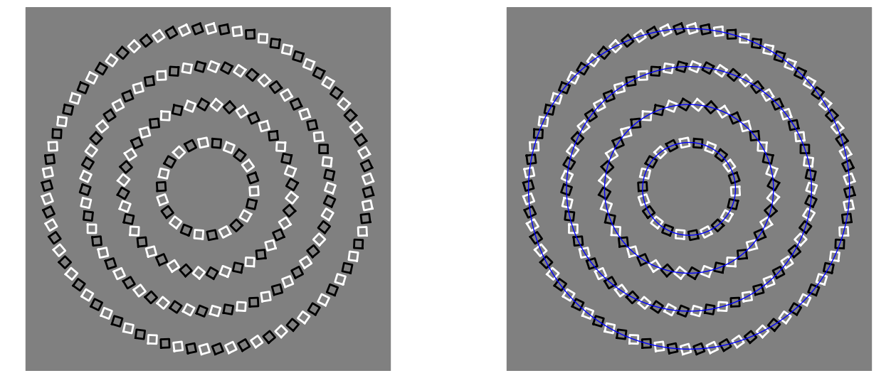

An optical illusion created by placing squares in circles and rotating them in a way that guides the eyes towards the other circles.

I first saw this here: https://twitter.com/Rainmaker1973/status/1437060933684236292?s=19
which links to here: https://slate.com/technology/2009/08/square-circle-spiral.html
and in turn it links here: https://richardwiseman.wordpress.com/2009/08/18/join-in-with-the-battle-of-clever-stuff/ but this link is dead,
but here is the author's twitter: https://twitter.com/richardwiseman
